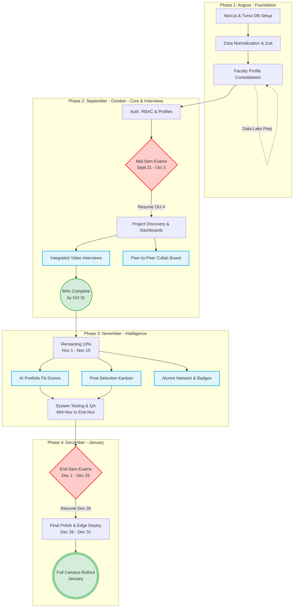
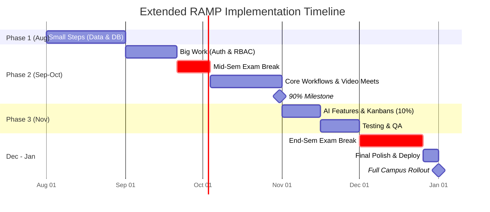

# RAMP (Research, Academic & Mentorship Portal) Extended Proposal

## Executive Summary
This proposal outlines the implementation roadmap for the extended Thapar Research, Academic & Mentorship Portal (RAMP). Our primary objective is to complete **90% of the core platform by the end of October**, leaving November for advanced intelligent features and testing, prior to a **full campus rollout in January**.

To make this portal state-of-the-art, we are integrating intelligent student screening, in-dashboard video interviews, and post-selection project tracking.

## Timeline & Phases

### Phase 1: Foundation & Data Aggregation (August)
* **Objective:** Establish system architecture, database design, and migrate legacy data into the new ecosystem.
* **Workload:** "Small steps" involving Next.js scaffolding, Turso DB (LibSQL) configuration, and strict schema validation using TypeScript and Zod.
* **Key Tasks:** Consolidating faculty profiles, research papers, and domains into a unified, high-speed database. Structuring the Data-Lake to support future AI integrations.

### Phase 2: "Big Work" & 90% Milestone (September – October)
* **Objective:** Rapid feature expansion covering Secure Access, Core Application Workflow, and Interview Integration.
* **Sept 1 – Sept 20:** Aggressive development on Enterprise-grade Authentication, Role-Based Access Control (RBAC), and dynamic User Profiles.
* **Sept 21 – Oct 3:** 🛑 **Mid-Semester Exam Break** (Development paused).
* **Oct 4 – Oct 31:** 
  * Resume heavy development focusing on Project Posting and Student Discovery.
  * **Centralized Faculty Review Dashboards** (1-click accept/reject).
  * **NEW:** **Integrated Video Meets** — allowing faculty to schedule and launch selection interviews natively from the dashboard (via WebRTC/Jitsi).
  * **NEW:** **Peer-to-Peer Collab Board** — enabling interdisciplinary student collaboration.
* **Milestone Check:** By October 31st, 90% of the portal's core features will be implemented.

### Phase 3: Advanced Intelligence & Workspaces (November 1 – Mid-November)
* **Objective:** Complete the remaining 10% representing the advanced "Future Horizons".
* **Workload:** 
  * **NEW:** **AI-Powered Portfolio Analysis** — automatically analyzing student GitHub repos to generate a compatibility "Fit Score" for projects.
  * **NEW:** **Post-Selection Kanban Workspaces** — giving selected students and faculty a built-in tracker for milestones (Lit Review, Drafts, etc.).
  * **NEW:** **Alumni Mentorship Network & Gamified Badges** for research achievements.

### Testing & QA (Mid-November – End of November)
* **Objective:** Comprehensive load testing on Cloudflare's Edge network, RBAC security audits, and UI/UX polishing.

### Final Exam Break & Rollout Prep (December – January)
* **Dec 1 – Dec 25:** 🛑 **End-Semester Exam Break** (Development paused).
* **Dec 26 – Dec 31:** Final polish, bug fixes, and User Acceptance Testing (UAT) with a select group of faculty.
* **January:** 🚀 **Full Rollout at Thapar Campus**.

---

## Visual Roadmap

*(Note: You can copy and paste the code below into Excalidraw via `Insert -> Diagram` to generate an editable flowchart).*

### 1. Extended Workflow & Phases Diagram

### 2. Timeline Gantt Chart

